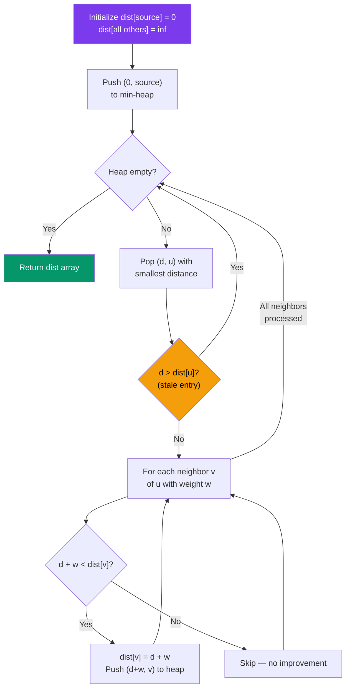

# Dijkstra

## Problem

Given a weighted directed graph and a source vertex, find the
shortest path from the source to every other reachable vertex.

## Approach

Dijkstra's algorithm using a min-heap (priority queue). Greedily
expand the nearest unvisited node and relax its outgoing edges.

### Algorithm Flow



## When to Use

Shortest path with NON-NEGATIVE weights. Flight routing, network latency,
road navigation. For negative weights use Bellman-Ford instead.
target employer relevance: core of route optimization in domain platform.

## Complexity

| | |
|---|---|
| **Time** | `O((V + E) log V)` |
| **Space** | `O(V + E)` |

## Implementation

=== "Solution"

    ::: algo.graphs.dijkstra
        options:
          show_source: true

=== "Tests"

    ```python title="tests/graphs/test_dijkstra.py"
    --8<-- "tests/graphs/test_dijkstra.py"
    ```

=== "Challenge"

    !!! question "Implement it yourself"

        **Run:** `just challenge graphs dijkstra`

        Then implement the functions to make all tests pass.
        Use `just study graphs` for watch mode.

    ??? success "Reveal Solution"

        ::: algo.graphs.dijkstra
            options:
              show_source: true
