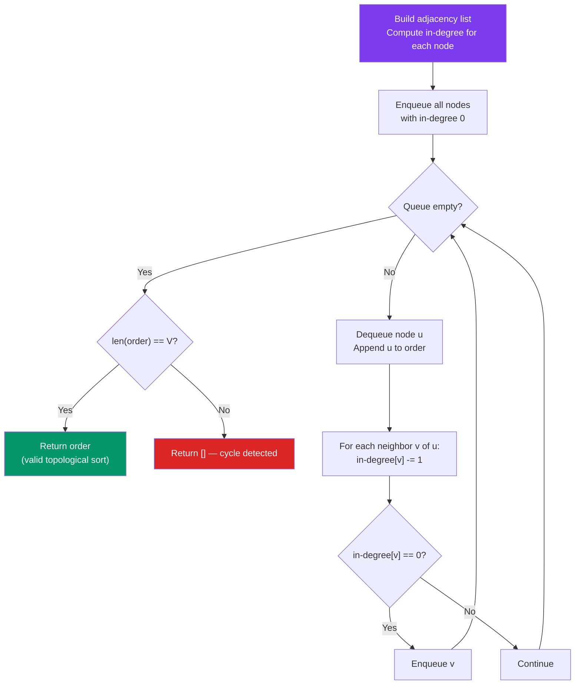

# Topological Sort

## Problem

Given a DAG represented as an adjacency list, return a valid
topological ordering of its vertices. If the graph has a cycle,
return an empty list.

## Approach

1. Kahn's algorithm (BFS): Track in-degrees; repeatedly dequeue
   nodes with in-degree 0 and decrement neighbors' in-degrees.
2. DFS-based: Post-order DFS; reverse the finish order.

### Algorithm Flow



## When to Use

Dependency resolution — "build order", "task scheduling with prereqs",
"compile order". Any DAG where you need a valid linear ordering.
Also: package managers, makefile targets, course planning.

## Complexity

| | |
|---|---|
| **Time** | `O(V + E)` |
| **Space** | `O(V + E)` |

## Implementation

=== "Solution"

    ::: algo.graphs.topological_sort
        options:
          show_source: true

=== "Tests"

    ```python title="tests/graphs/test_topological_sort.py"
    --8<-- "tests/graphs/test_topological_sort.py"
    ```

=== "Challenge"

    !!! question "Implement it yourself"

        **Run:** `just challenge graphs topological_sort`

        Then implement the functions to make all tests pass.
        Use `just study graphs` for watch mode.

    ??? success "Reveal Solution"

        ::: algo.graphs.topological_sort
            options:
              show_source: true
