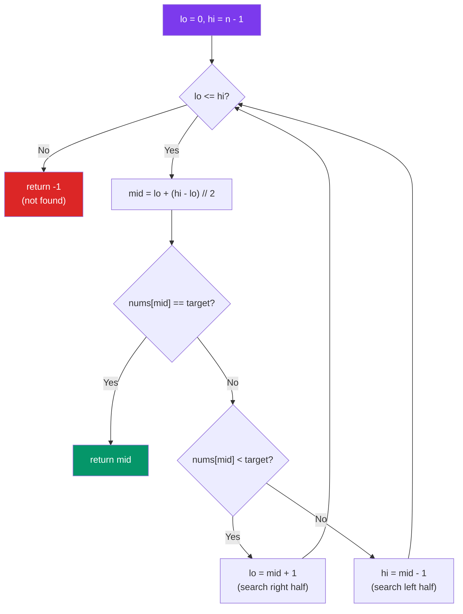

# Binary Search

## Problem

Given a sorted array of integers and a target value, return the
index of the target if found, otherwise return -1.

## Approach

Both iterative and recursive implementations. Maintain lo/hi
bounds; compute mid = lo + (hi - lo) // 2 to avoid overflow.

### Algorithm Flow



## When to Use

Sorted array lookup or any monotonic predicate search — "find target",
"first/last occurrence", "search insert position". Foundation for
bisect-based optimizations. Aviation: altitude/waypoint lookup tables.

## Complexity

| | |
|---|---|
| **Time** | `O(log n)` |
| **Space** | `O(1) iterative, O(log n) recursive (call stack)` |

## Implementation

=== "Solution"

    ::: algo.searching.binary_search
        options:
          show_source: true

=== "Tests"

    ```python title="tests/searching/test_binary_search.py"
    --8<-- "tests/searching/test_binary_search.py"
    ```

=== "Challenge"

    !!! question "Implement it yourself"

        **Run:** `just challenge searching binary_search`

        Then implement the functions to make all tests pass.
        Use `just study searching` for watch mode.

    ??? success "Reveal Solution"

        ::: algo.searching.binary_search
            options:
              show_source: true
