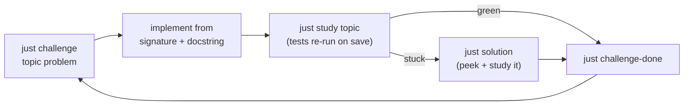

# Getting Started

This packet has two halves that work together:

- **This web site** is your *reference shelf* — browse every algorithm, concept
  module, reference sheet, the [decision tree](when-to-use-what.md), and the
  printable PDF. Read it when you need to look something up or refresh a pattern.
- **The local CLI** is your *gym* — `just challenge` strips a solution down to its
  signature and docstring so you re-implement it from scratch, with tests as your
  spotter.

Read on the site, drill in the terminal. Active recall is where the learning
actually happens; the site is there to unstick you, not to read passively.

!!! tip "The one-sentence loop"
    Browse a pattern on the site → `just challenge` it in the terminal →
    `just study` until tests go green → `just challenge-done`. Repeat across the
    [Core 43](../challenges/index.md).

---

## 1. One-time local setup

You only need the CLI for the drill loop. Everything is pinned by a Nix flake
and synced with [`uv`](https://docs.astral.sh/uv/), so setup is one command.

=== "direnv (recommended)"

    The repo ships a `.envrc` that loads the flake automatically:

    ```bash
    direnv allow
    ```

    The first time, this drops you into the Nix devshell, creates a
    `.venv` with **Python 3.14**, and runs `uv sync --all-extras`. After that,
    `cd`-ing into the repo activates the environment automatically — no manual
    step. Tools provided by the shell: `python`, `uv`, `just`, `watchexec`,
    `tectonic`, and `pandoc`.

=== "nix develop (no direnv)"

    If you do not use direnv, enter the devshell by hand:

    ```bash
    nix develop --impure
    ```

    Same result — venv created, deps synced, tools on `PATH`. Re-run it each
    time you open a new shell.

=== "uv only (no Nix)"

    If you cannot run Nix, you need **Python 3.14+** and `uv` on your own, then:

    ```bash
    uv sync --all-extras
    ```

    For PDF generation you will also need `tectonic` and `pandoc`; for watch
    mode you need `watchexec`. The Nix devshell is the supported path because it
    pins all of these for you.

!!! note "Verify the install"
    ```bash
    just            # list every recipe
    just test       # full pytest + Hypothesis suite
    just lint       # ruff + mypy strict + public-boundary check
    ```
    A green `just test` means the environment is good to go.

---

## 2. The daily drill loop

Each problem is one tight cycle. Run it in a terminal next to your editor.



The four commands, in order:

```bash
just challenge graphs dijkstra    # strip the solution → you implement it
just study graphs                 # watch mode: tests re-run on every save
just solution graphs dijkstra     # restore the reference solution if stuck
just challenge-done graphs dijkstra
```

What each one does:

| Command | What happens |
|---------|--------------|
| `just challenge <topic> <problem>` | Backs up the real solution, strips the file to its signature + docstring, and prints the now-failing tests. |
| `just study <topic>` | Runs `pytest` for that topic in watch mode — every save re-runs the tests instantly. Leave it open while you code. |
| `just solution <topic> <problem>` | Restores the full reference implementation from the backup. |
| `just challenge-done <topic> <problem>` | Records the problem (with today's date) in your progress log. |
| `just challenge-progress` | Prints everything you have completed so far. |

!!! info "Your work is never lost"
    `challenge` snapshots the original to `.challenges/` before stripping it, so
    `just solution` can always bring it back. `.challenges/` is local and
    gitignored — it is your scratch space, not part of the packet.

---

## 3. Daily cadence

The goal is interview pace and full coverage, not perfection on the first try.

| Habit | Why |
|-------|-----|
| **~25 min per problem** | That is realistic interview pace. If you blow past it, stop and peek — a slow win still teaches the pattern. |
| **Talk out loud** | Narrate your approach as you code. Interviews score communication, not just the final answer. |
| **Pattern in 3 min** | If you cannot name the pattern within ~3 minutes, open the [decision tree](when-to-use-what.md) before writing code. |
| **Peek deliberately** | Stuck after a genuine attempt? Run `just solution`, *read and re-derive* it, then re-challenge it tomorrow. Peeking to learn is fine; peeking to skip is not. |
| **Mark honestly** | Run `just challenge-done` and grade yourself. Re-drill your misses first the next day. |

Grade each pass as you mark it complete:

| Mark | Meaning |
|------|---------|
| :white_check_mark: | Solved from memory, under 25 min |
| :warning: | Needed a hint or ran slow |
| :x: | Could not solve |

Re-drill every :warning: and :x: **first** the next session. A practical weekly
rhythm: one full pass of the [Core 43](../challenges/index.md) per day, leading
with yesterday's misses, until the whole set is green from memory.

!!! tip "Start small"
    A solid first session is one topic, top to bottom:
    ```bash
    just challenge arrays two_sum
    just study arrays
    ```
    The [Daily Drill](../challenges/index.md) page lists copy-paste blocks for all
    43 problems, topic by topic.

---

## 4. How the site and the CLI fit together

Source code, tests, and authored notes are the single source of truth; the docs
and PDF are *generated* from them (see [Source of Truth](source-of-truth.md)).
That is why the two surfaces always agree.

| When you want to… | Use | Where |
|-------------------|-----|-------|
| Re-implement a problem from scratch | `just challenge` / `just study` | terminal |
| Identify which pattern a prompt needs | [Decision tree](when-to-use-what.md) | web |
| Plan a four-hour interview-prep block | [Interview practice evidence](interview-practice-evidence.md) | web |
| See a full reference implementation + complexity | [Algorithms](../algorithms/index.md) | web |
| Map a pattern to its implementations | [Cross-reference guide](../reference/08-cross-reference-guide.md) | web |
| Brush up on language/stdlib/system-design | [Reference sheets](../reference/index.md) and [Concepts](../concepts/index.md) | web |
| Track your streak and misses | `just challenge-progress` | terminal |

Run the site locally any time — it live-reloads as content changes:

```bash
just docs          # serve at http://127.0.0.1:8000 with live reload
```

---

## 5. Offline study with the printable PDF

For whiteboard prep, flights, or any non-electronic session, the entire packet
compiles to a single printable booklet — decision trees, pattern keywords,
selected notes, and every algorithm with its full implementation.

```bash
just packet        # regenerate booklet.pdf (and the copy embedded in these docs)
```

This rebuilds the LaTeX booklet from the current code and notes, compiles it
with `tectonic`, and refreshes the version embedded on the site. You can grab
the latest build straight from the web:

[:material-download: Download the PDF packet](../assets/booklet.pdf){ .md-button .md-button--primary }

!!! tip "Print just the cheat sheets"
    Want individual reference sheets instead of the full booklet?
    ```bash
    just pdf-all   # render each reference sheet to reference-sheets/pdf/
    ```

---

## Where to next

<div class="grid cards" markdown>

-   :material-rocket-launch:{ .lg .middle } **Start drilling**

    ---

    Copy-paste blocks for all 43 core problems.

    [:octicons-arrow-right-24: Daily Drill](../challenges/index.md)

-   :material-map:{ .lg .middle } **Pick the pattern**

    ---

    Map a problem's signals to the right approach.

    [:octicons-arrow-right-24: Decision Tree](when-to-use-what.md)

-   :material-source-branch:{ .lg .middle } **How it's built**

    ---

    What is authored vs. generated, and why.

    [:octicons-arrow-right-24: Source of Truth](source-of-truth.md)

</div>
