# When to Use What -- Decision Tree

Use this page when you see a new problem and need to identify the right pattern. Start at the top of the decision tree and follow the branches.

---

## Master Decision Tree

```mermaid
graph TD
    START["What does the problem ask for?"]

    START --> FIND["Find / search for something"]
    START --> OPTIMIZE["Optimize a value<br/>(min cost, max profit, count ways)"]
    START --> GENERATE["Generate all / enumerate"]
    START --> SEQUENCE["Process a sequence<br/>(subarray, substring)"]
    START --> GRAPH["Graph structure<br/>(explicit or implicit)"]
    START --> DESIGN["Design a data structure"]

    %% FIND branch
    FIND --> SORTED{"Input is sorted?"}
    SORTED -->|YES| BSEARCH["Binary Search<br/>searching/binary_search.py"]
    SORTED -->|"Rotated?"| ROTATED["search_rotated_array.py<br/>find_minimum_rotated.py"]
    SORTED -->|NO| HASHMAP["Hash Map O(n) lookup<br/>arrays/two_sum.py"]
    FIND --> FINDGRAPH{"Find in a graph?"}
    FINDGRAPH -->|Unweighted| BFS["BFS<br/>graphs/number_of_islands.py"]
    FINDGRAPH -->|"Weighted +"| DIJKSTRA["Dijkstra<br/>graphs/dijkstra.py"]
    FINDGRAPH -->|"Weighted -"| BELLMAN["Bellman-Ford<br/>graphs/bellman_ford.py"]
    FINDGRAPH -->|Heuristic| ASTAR["A* Search<br/>graphs/a_star_search.py"]

    %% OPTIMIZE branch
    OPTIMIZE --> OVERLAP{"Overlapping<br/>subproblems?"}
    OVERLAP -->|YES| DP["Dynamic Programming"]
    DP --> DP1D["1D: climbing_stairs, coin_change"]
    DP --> DP2D["2D: edit_distance, longest_common_subseq"]
    DP --> DPBIT["Bitmask: traveling_salesman_dp"]
    OVERLAP -->|NO| GREEDY["Greedy<br/>merge_intervals, jump_game,<br/>interval_scheduling"]
    OPTIMIZE --> TOPK{"Top-K or<br/>priority ordering?"}
    TOPK -->|"Kth element"| HEAP["Heap<br/>heaps/kth_largest.py"]
    TOPK -->|"Merge K"| HEAPMERGE["Heap Merge<br/>heaps/merge_k_sorted_lists.py"]

    %% GENERATE branch
    GENERATE --> SUBSETS["All subsets<br/>backtracking/subsets.py"]
    GENERATE --> PERMS["All permutations<br/>backtracking/permutations.py"]
    GENERATE --> COMBSUM["Combinations to sum<br/>backtracking/combination_sum.py"]
    GENERATE --> PLACEMENT["Placement with rules<br/>backtracking/n_queens.py"]

    %% SEQUENCE branch
    SEQUENCE --> CONTIG{"Contiguous?"}
    CONTIG -->|YES| WINDOW["Sliding Window"]
    WINDOW --> FIXEDWIN["Fixed size: standard pattern"]
    WINDOW --> VARWIN["Variable: min_window_substring,<br/>longest_substring_no_repeat"]
    CONTIG -->|NO| SUBSEQ["Subsequence DP<br/>longest_increasing_subseq,<br/>longest_common_subseq"]
    SEQUENCE --> NEXTGT["Next greater/smaller?<br/>Monotonic Stack<br/>stacks_queues/daily_temperatures.py"]
    SEQUENCE --> NESTING["Valid nesting?<br/>Stack<br/>stacks_queues/valid_parentheses.py"]

    %% GRAPH branch
    GRAPH --> COMPONENTS["Connected components<br/>DFS/BFS or Union-Find<br/>graphs/number_of_islands.py"]
    GRAPH --> DEPORDER["Dependency ordering<br/>Topological Sort<br/>graphs/topological_sort.py"]
    GRAPH --> CYCLE["Cycle detection<br/>graphs/course_schedule.py"]
    GRAPH --> CLONE["Clone / copy<br/>graphs/clone_graph.py"]
    GRAPH --> MST["Min spanning tree<br/>graphs/minimum_spanning_tree.py"]
    GRAPH --> MAXFLOW["Maximum flow<br/>graphs/network_flow.py"]

    %% DESIGN branch
    DESIGN --> LRU["O(1) access + eviction<br/>linked_lists/lru_cache.py"]
    DESIGN --> MINSTACK["O(1) min/max retrieval<br/>stacks_queues/min_stack.py"]
    DESIGN --> SORTEDDS["Sorted insert + search<br/>bisect / SortedList"]
    DESIGN --> GENERIC["Generic typed container<br/>concepts/advanced_typing.py"]

    %% Styling
    classDef start fill:#6366f1,color:#fff,stroke:#4f46e5
    classDef branch fill:#f59e0b,color:#000,stroke:#d97706
    classDef leaf fill:#10b981,color:#fff,stroke:#059669
    classDef decision fill:#fff,color:#000,stroke:#6b7280

    class START start
    class FIND,OPTIMIZE,GENERATE,SEQUENCE,GRAPH,DESIGN branch
    class BSEARCH,ROTATED,HASHMAP,BFS,DIJKSTRA,BELLMAN,ASTAR leaf
    class DP1D,DP2D,DPBIT,GREEDY,HEAP,HEAPMERGE leaf
    class SUBSETS,PERMS,COMBSUM,PLACEMENT leaf
    class FIXEDWIN,VARWIN,SUBSEQ,NEXTGT,NESTING leaf
    class COMPONENTS,DEPORDER,CYCLE,CLONE,MST,MAXFLOW leaf
    class LRU,MINSTACK,SORTEDDS,GENERIC leaf
    class SORTED,FINDGRAPH,OVERLAP,TOPK,CONTIG decision
```



---

## Problem Type Quick Reference

=== "Arrays & Hashing"

    | When You See... | Use This | Implementation |
    |---|---|---|
    | "Find two values that sum to X" | Hash map lookup | `arrays/two_sum.py` |
    | "Group items by property" | Hash map grouping | `arrays/group_anagrams.py` |
    | "Top K / most frequent" | Bucket sort or heap | `arrays/top_k_frequent.py` |
    | "Product without self" | Prefix/suffix arrays | `arrays/product_except_self.py` |

=== "Two Pointers"

    | When You See... | Use This | Implementation |
    |---|---|---|
    | "Three values sum to zero" | Sort + two pointers | `two_pointers/three_sum.py` |
    | "Maximum area / container" | Converging pointers | `two_pointers/container_with_most_water.py` |
    | "Water trapped between bars" | Pointers + max tracking | `two_pointers/trapping_rain_water.py` |

=== "Sliding Window"

    | When You See... | Use This | Implementation |
    |---|---|---|
    | "Minimum window containing chars" | Variable sliding window | `sliding_window/min_window_substring.py` |
    | "Longest substring without repeat" | Sliding window + hash | `sliding_window/longest_substring_no_repeat.py` |

=== "Stacks & Queues"

    | When You See... | Use This | Implementation |
    |---|---|---|
    | "Valid brackets/parentheses" | Stack matching | `stacks_queues/valid_parentheses.py` |
    | "Min/max in O(1)" | Auxiliary stack | `stacks_queues/min_stack.py` |
    | "Next greater/warmer element" | Monotonic stack | `stacks_queues/daily_temperatures.py` |

=== "Graphs"

    | When You See... | Use This | Implementation |
    |---|---|---|
    | "Connected components / islands" | BFS/DFS flood fill | `graphs/number_of_islands.py` |
    | "Dependency ordering" | Topological sort | `graphs/topological_sort.py` |
    | "Shortest path (positive)" | Dijkstra | `graphs/dijkstra.py` |
    | "Shortest path (negative)" | Bellman-Ford | `graphs/bellman_ford.py` |
    | "Pathfinding with heuristic" | A* search | `graphs/a_star_search.py` |
    | "Minimum cost to connect all" | Kruskal's MST | `graphs/minimum_spanning_tree.py` |
    | "Maximum flow" | Edmonds-Karp | `graphs/network_flow.py` |
    | "Spatial proximity" | Geohash / KD-tree | `graphs/geohash_grid.py`, `graphs/kd_tree.py` |

=== "Dynamic Programming"

    | When You See... | Use This | Implementation |
    |---|---|---|
    | "Count ways to reach target" | Fibonacci-like DP | `dp/climbing_stairs.py` |
    | "Minimum cost to reach amount" | Bottom-up DP | `dp/coin_change.py` |
    | "Longest increasing subsequence" | DP + binary search | `dp/longest_increasing_subseq.py` |
    | "String edit distance" | 2D DP | `dp/edit_distance.py` |
    | "0/1 Knapsack" | 1D optimized DP | `dp/knapsack.py` |
    | "Visit all cities" | Bitmask DP (TSP) | `dp/traveling_salesman_dp.py` |

=== "Backtracking"

    | When You See... | Use This | Implementation |
    |---|---|---|
    | "Generate all subsets" | Backtracking | `backtracking/subsets.py` |
    | "Generate all permutations" | Backtracking | `backtracking/permutations.py` |
    | "Combinations summing to target" | Backtracking w/ reuse | `backtracking/combination_sum.py` |
    | "N queens placement" | Backtracking + pruning | `backtracking/n_queens.py` |

=== "Heaps & Greedy"

    | When You See... | Use This | Implementation |
    |---|---|---|
    | "Kth largest element" | Min-heap of size k | `heaps/kth_largest.py` |
    | "Merge k sorted lists" | Heap merge | `heaps/merge_k_sorted_lists.py` |
    | "Task scheduling" | Max-heap + queue | `heaps/task_scheduler.py` |
    | "Merge overlapping intervals" | Sort + merge | `greedy/merge_intervals.py` |
    | "Can reach end? Min jumps?" | Greedy max-reach | `greedy/jump_game.py` |
    | "Max non-overlapping intervals" | Greedy by end time | `greedy/interval_scheduling.py` |

---

## Pattern Recognition Keywords

When you read a problem statement, look for these keywords and jump to the right approach.

| Keyword | First Thing to Try | Fallback |
|---|---|---|
| "sorted" | Binary search, two pointers | -- |
| "contiguous subarray" | Sliding window | Prefix sums, Kadane's |
| "substring" | Sliding window + hash map | DP |
| "parentheses" / "brackets" | Stack | -- |
| "next greater" / "next warmer" | Monotonic stack | -- |
| "shortest path" | BFS (unweighted), Dijkstra (weighted) | Bellman-Ford, A* |
| "connected" / "island" / "region" | DFS/BFS flood fill, Union-Find | -- |
| "dependency" / "prerequisite" | Topological sort | -- |
| "cycle" | DFS coloring (directed), Union-Find (undirected) | -- |
| "minimum cost" / "count ways" | Dynamic programming | -- |
| "all subsets" / "all combinations" | Backtracking | Bitmask enumeration |
| "merge" / "overlapping intervals" | Sort + greedy sweep | -- |
| "kth largest" / "top k" | Heap of size k | Quickselect |
| "design" / "implement" | Choose data structures, define API | -- |
| "cache" / "eviction" | Hash map + doubly linked list (LRU) | -- |
| "stream" / "online" | Heap, sliding window | -- |
| "frequency" / "how many times" | Hash map / Counter | -- |
| "edit distance" / "transform" | 2D DP | BFS (word ladder) |
| "knapsack" / "subset sum" | DP (1D or 2D) | -- |
| "schedule tasks" | Heap + greedy | Topological sort if deps |
| "maximum flow" | Edmonds-Karp / Ford-Fulkerson | -- |
| "nearest point" / "proximity" | KD-tree, geohash | -- |
| "visit all cities/nodes" | TSP bitmask DP | -- |
| "XOR" / "single unique" | Bit manipulation | -- |

---

## Data Structure Selection

```
Need key -> value?          --> dict
Need "is X in the set?"    --> set
Need min/max repeatedly?   --> heapq
Need FIFO?                 --> collections.deque
Need LIFO?                 --> list (append/pop)
Need sorted insert+search  --> bisect / SortedList
Need merge/find groups?    --> Union-Find
Need nearest in 2D/3D?     --> KD-tree or geohash
```
